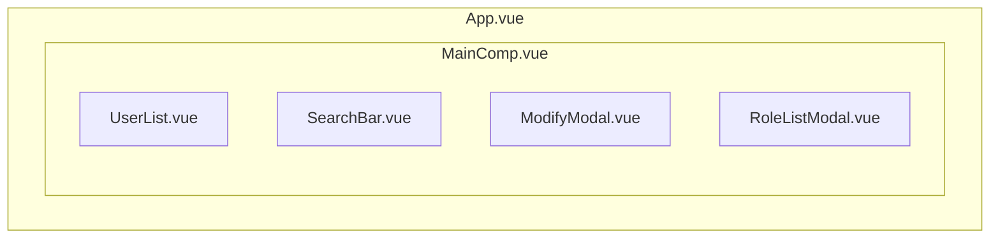

# - 프로젝트 개요
이전 React 프로젝트에 사용자 관리 메뉴를 통해 Spring Security의 사용자 권한 제어를 확인 하는 페이지를 구현 하였고 실제 사용자를 관리하는 기능은 Vuejs를 통해 간단하게 구현해 보았다.\
**Vue와 React를 동일 프로젝트에서 구성하는 것은 UI 프레임워크의 목적에 맞지 않으므로 Vuejs를 사용하여 간단한 프로젝트를 별도로 진행 하였다.**

# - 개발기간
- 2025.05 ~ 2025.05(약 0.5개월)
# - 개발환경
- node.js v18.20.5
- vue v3.5.13, vuetify v3.8.1
- vuex v4.1.0
# - 주요기능
- 사용자의 리스트를 보여주는 페이지와 페이징 및 검색 기능 
- 사용자의 정보를 변경 및 삭제 하는 기능을 간단히 구현
- Vuejs를 위한 디자인 UI 프레임워크 vuetify를 사용하여 페이지 디자인을 구현 하였으며 백엔드 부분의 데이터 처리를 위해 Axios 라이브러리를 사용

# -  컴포넌트 구조


# - 상세기능
### 1. 데이터 처리
컴포넌트간 데이터 전달을 위해 props와 emit메서드를 통한 데이터 전달, vuex 라이브러리를 통한 중앙 집중식 저장소 방식 2가지를 사용 해보았다

#### 1.1 props 사용 방식
props 사용 방식을 통해 하위 컴포너트로 데이터를 전달하고 자식과 부모 사이는 하향식 단방향 바인딩 형태 이어야 하므로 하위 컴포넌트의 클릭 이벤트 등에 대한 처리는 **emit** 메서드를 통해 이벤트를 호출 하는 방식으로 구현 하였으며 사용자 리스트의 페이징과 검색 기능에 props을 통한 데이터 전달 방식을 사용 하였다.

##### 1.1.1 페이징
페이징은 UserList 컴포넌트에 구현 하였으며 부모 컴포넌트와 페이징에 관련된 prop를 전달받고 자식 컴포넌트에서 부모 컴포넌트의 메서드를 실행하는 이벤트를 발생 시킨다.
- App.vue
```js

<MainComp
// 상위 컴포넌트는 userList, currentPage 값 등을 UserList 컴포넌트에 전달하고 @pageClick을 통해 이벤트를 수신한다
  :userList=userList
  :currentPage=currentPage
  :pageLength=pageLength
  @pageClick='pageClick'
  @selectFiled='selectFiled'
  @inputSearch='inputSearch'
  :searchFiled='searchFiled'
  :searchTxt='searchTxt'
  @userSearch='userSearch'
  @showModalPop='showModalPop'
/>
...

// getData에서 Axios를 통해 사용자 리스트를 요청하는 api url 호출 
const getData = async () => {

await Axios.get('http://localhost:8090/api/v1/user/userList', {
  params: {
        page: currentPage.value,
        size: '5',
        sort: 'createdTime,desc',
        searchKey: searchFiled.value,
        searchValue: searchTxt.value
      },
      headers: {
        access: localStorage.getItem('access')
      },
  }).then((response) => {
      // 사용자 리스트와 페이징 값을 리턴 받는다.
      userList.value = response.data.content;
      pageLength.value= response.data.totalPages;
  }).catch(function (error) {
    console.log('error : ' + error)
  });
...
// 자식 컴포넌트에의해 pageClick이 호출되어 백엔드의 요청 페이지에 해당되는 사용자 리스트를 가져온다.
const pageClick = (page) => {
  currentPage.value = page;
  getData();
}
``` 
위 처럼 상위 컴포너트를 통해 자식 컴포넌트로 값을 전달 하고 자식컴포넌트 들에서도 **defineProps**를 매크로를 사용하여 props를 선언하여 구현 하였다.

- MainComp.vue
```js
const props = defineProps(['userList', 'currentPage', 'pageLength', 'showModal'])
```
- UserList.vue
```js
...
const props = defineProps(['userList', 'currentPage', 'pageLength', 'showModal'])
const emit = defineEmits(['mainPageClick', 'showModalPop'])

// emit을 통해 부모 컴포넌트의 mainPageClick 이벤트를 유발하고 상위 컴포넌트인 MainComp에서 mainPageClick 이벤트를 통해 최상위 컴포넌트의 pageClick을 호출한다.
function handlePageClick(pageVal) {
  emit('mainPageClick', pageVal);
}
...
<v-pagination
    //pagination에 부모로 부터 받은 props.currentPage, props.pageLength을 할당받는다.
    v-model="props.currentPage"
    :length="props.pageLength"
    rounded="circle"
    // @update:model-value="handlePageClick"를 통해 ref 값 변경 시 handlePageClick을 호출
    @update:model-value="handlePageClick">
</v-pagination>
```
- 페이징 동작화면


##### 1.1.2 검색
SearchBar 컴포넌트를 통해 검색 기능을 구현 하였고 검색 대상 필드, 검색어 값 등을 emit메서드를 통해 전달 한다.
- SearchBar.vue
```js
<v-text-field
  :loading="loading"
  append-inner-icon="mdi-magnify"
  density="compact"
  label="Search templates"
  variant="solo"
  hide-details
  single-line
    // @click, @update, @userSearch를 통해 검색 대상 필드 선택이나 검색어 입력, 검색 버튼 클릭 시 이벤트를 발생 시킴
  @click:append-inner="userSearch"
  @update:modelValue="inputSearch"
  @userSearch="userSearch"
>
</v-text-field>
...
const emit = defineEmits(['pageClick', 'selectFiled', 'inputSearch', 'mainPageClick'])
// 발생된 이벤트에서 emit메서드로 부모 컴포넌트로 인수를 전달하고, 이벤트 발생 시킨다.
const selectFiled = (selectSearchFiled) => {
  emit('selectFiled', selectSearchFiled);
}

const inputSearch = (inputSearch) => {
  emit('inputSearch', inputSearch);
}

const userSearch = () => {
  emit('userSearch');
  emit('mainPageClick', 1);
}
```
- App.vue
```js

<MainComp
  :userList=userList
  :currentPage=currentPage
  :pageLength=pageLength
  @pageClick='pageClick'
  @selectFiled='selectFiled'
  @inputSearch='inputSearch'
  :searchFiled='searchFiled'
  :searchTxt='searchTxt'
  // emit으로 검색 필드와 검색 텍스트를 전달 받고 사용자 검색 이벤트가 발생된다
  @userSearch='userSearch'
  @showModalPop='showModalPop'
/>
...
// userSearch에서 getData를 호출하여 검색필드와 검색어를 사용자 리스트 api url에 전달한다. 
const userSearch = () => {
  getData();
}
```
- 검색 동작화면


#### 1.2 Vuex 라이브러리 사용 방식
여러 컴포넌트간에 저장소 공유를 위해 Vuejs 애플리케이션에 대한 상태 관리 패턴 라이브러리인 Vuex를 사용해 보았으며 state와 mutations, promise 결과에 따른 작업 처리를 위한 actions를 store.js에 선언 하여 사용 하였다.

##### 1.2.1 store.js
- store.js
```js
export const store = new Vuex.Store({
  // 컴포넌트들에서 공유할 state를 정의
  state: {
    showModifyModal: false,
    showRoleListModal: false,
    userId: 0,
    userDetail: [],
    exceptRoleList: [0],
    roleList: [],
    updateRoleList: [],
    roleUserSave: []

  },
// 컴포넌트에서 state를 변경을 위한 mutations를 정의
mutations: {
    showModifyModal (state) {
      state.showModifyModal = !state.showModifyModal
    },
    showRoleListModal (state) {
      state.showRoleListModal = !state.showRoleListModal
    },
    ...
// Promise 반환 처리가 필요한 기능은 actions을 통해 정의한다. await 작업은 동기적이지만 Vuex 상태변이는 비동기적인 관점이다. 
actions: {
async getUserData ({ state, commit }) {
  await Axios.post('http://localhost:8090/api/v1/user/userDetail',
  {
    id: state.userId
  },
    {
        headers: {
        access: localStorage.getItem('access')
        }
  }).then((response) => {
    commit('setUserDetail', response.data);
... 
```
store에 선언된 state와 mutations, actions를 통해 사용자의 상세 정보, 정보 수정, 삭제 등을 처리 할수 있도록 하였다.

##### 1.2.2 사용자 수정
UserList 컴포넌트에서 수정 버튼 클릭 시 ModifyModal 보이게 하여 사용자 수정 기능이 가능 하도록 하였다.
- UserList.vue
```js
...
// 수정 버튼 클릭 시 store의 showModifyModal mutations을 호출하고 showModifyModal state를 true로 변경
<td><v-btn color="#5865f2"
  size="small"
  variant="flat"
  @click="store.commit('showModifyModal'), store.commit('setUserId', users.id), store.dispatch('getUserData')">Modify</v-btn></td>
<td><v-btn color="#5865f2"
```

- ModifyModal.vue
```js
// click 리스너를 통해 onClick 이벤트를 발생 시키고 setRoleUserSave mutations로 사용자 권한 state를 수정하고 userUpdate action으로 사용자 수정 api url을 호출한다.
<v-btn class="mt-2" type="submit" @click="userUpdate" block>Submit</v-btn>
...
// userUpdate에서 api 전달할 사용자 권한 리스트 state를 setRoleUserSave mutations을 통해 수정하고 store.dispatch('userUpdate')로 action 호출한다.
function userUpdate(){
  const roleUserSave = ref([]);

  store.state.userDetail.roleUser.map((roles) =>{
  roleUserSave.value.push(roles.roleId)
  })

  store.commit('setRoleUserSave', roleUserSave.value)
  store.dispatch('userUpdate')
}
```

- store.js
```js
...
// store의 사용자 권한 state를 수정 mutations
setRoleUserSave (state, roleUserSave) {
  state.roleUserSave = roleUserSave;
}
...
// store.dispatch('userUpdate')를 통해 userUpdate 액션을 호출하게 되고 사용자 정보와 수정된 데이터를 전달하여 사용자를 수정한다.
async userUpdate ({ state, commit }) {
  console.log('userUpdate state.userDetail : ' + JSON.stringify(state.userDetail));
  await Axios.post('http://localhost:8090/api/v1/user/userUpdate',
    {
      id: state.userDetail.id,
      loginId: state.userDetail.loginId,
      userName: state.userDetail.userName,
      userPassword: state.userDetail.userPassword,
      roleUserSave: state.roleUserSave
  },
    {
    headers: {
      access: localStorage.getItem('access')
      }
  }
  ).then(response => {
    commit('setRoleList', response.data);
    if(response.status === 200)
    {
      alert('Update Success');
      window.location.reload();
    }
  }).catch(function (error) {
    console.log('error : ' + error)
  });
},
```
- 사용자 수정 동작화면


### 2. 사용자 권한 수정
스프링 프로젝트에서 사용자는 여러 권한을 가질 수 있으며 해당 권한을 가진 사용자가 다수가 존재 할 수 있어 중간 관계 테이블을 추가하여 사용자와 권한 데이터를 관리 하도록 구성 하였다.
- 백엔드의 권한 제어 부분
```java
.requestMatchers("/api/v1/admin/*").hasAnyRole("ADMIN", "MANAGER")
.anyRequest().authenticated());
```
백엔드 영역에서 Spring Security의 SecurityConfig에서 관리자 권한을 여러 권한으로 체크 하도록 하였으므로 사용관 관리 페이지에서 사용자 수정 팝업 호출 하여 여러 권한을 추가, 삭제 할 수 있도록 하였다..

- store.js
```js
// store의 사용자 권한 리스트 요청 action
async getRoleList ({ state, commit }) {
  await Axios.post('http://localhost:8090/api/v1/user/roleList',
    state.exceptRoleList,
    // 현재 수정 팝업에 있는 권한 리스트를 state.exceptRoleList에 저장 하여 요청하여 추가 요청 대상 권한 리스트를 리턴 한다.
    {
      headers: {
        access: localStorage.getItem('access')
      },
    }

  ).then(response => {
    commit('setRoleList', response.data);
```
- 권한 리스트 팝업 동작


Role리스트를 호출 시 현재 팝업창에서 가져온 사용자의 권한 리스트를 제외한 리스트를 보여 주도록 하였다. 권한 추가 후 저장 시 권한 데이터를 가진 state를 request 값으로 전달하여 사용자의 권한 정보가 업데이트 되도록 하였다.

- store.js
```js
// store의 사용자 업데이트 요청 action
async userUpdate ({ state, commit }) {
  await Axios.post('http://localhost:8090/api/v1/user/userUpdate',
    {
      id: state.userDetail.id,
      loginId: state.userDetail.loginId,
      userName: state.userDetail.userName,
      userPassword: state.userDetail.userPassword,
      //유저 정보 업데이트 시 업데이트 될 권한 리스트를 함께 전달 한다
      roleUserSave: state.roleUserSave
  },
```
- 권한 리스트 수정 동작

